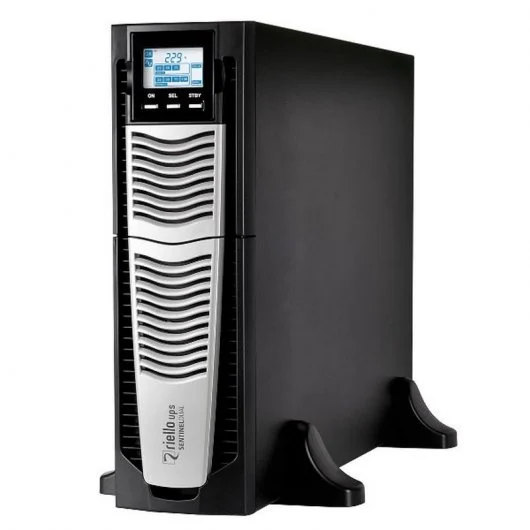
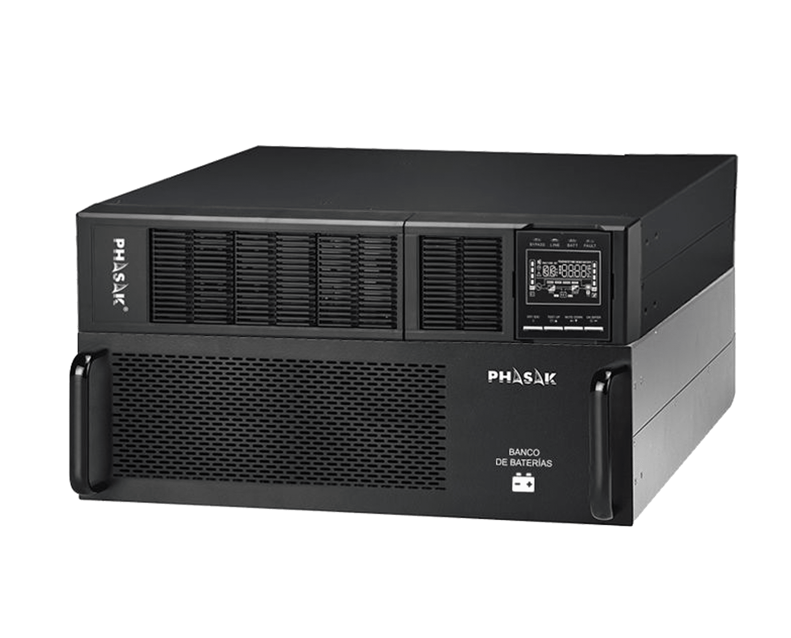

# ⚡ Informe de Selecció de Sistema d'Alimentació Ininterrompuda (SAI)

## 🧭 1. Introducció
Aquest informe té com a objectiu presentar els càlculs realitzats per determinar la **potència necessària** per a un conjunt d'equips informàtics i la **selecció d’un SAI adequat** per garantir la continuïtat operativa en cas d’interrupcions elèctriques.

---

## 🔢 Càlcul de potència total
S'han considerat els següents equips:

| Equip | Model | Potència (W) | Quantitat | Total (W) |
|:------|:------|:-------------:|:----------:|:----------:|
| Monitor | [ThinkCentre M90a Gen 6 (24″ Intel) AIO](https://www.lenovo.com/es/es/p/desktops/thinkcentre/m-series-aio/lenovo-thinkcentre-m90a-gen-6-24-inch-intel/len102c0063?orgRef=https%253A%252F%252Fwww.google.com%252F&srsltid=AfmBOor2Tbd0z_TU3-FICALbxv6GpiSe__EACFPW8-ZOOuqTSpMpL4gn) | 230 | 4 | 920 |
| Ordinador | [ThinkStation P3 Tower (Intel)](https://www.lenovo.com/es/es/p/workstations/thinkstationp/thinkstation-p3-tower-(intel)/len102s0016?orgRef=https%253A%252F%252Fwww.google.com%252F&srsltid=AfmBOooT8ZQNpILCsX0EvLrlyPt8OykJcZbSWJUx_hCRqFYTSgcuT62X) | 750 | 4 | 3000 |
| Router | [Mesh WiFi 6 AX3000](https://www.mercasat.es/routers/1007474-router-gigabit-mesh-wifi-6-ax3000-4-puertos-rj45-101001000-mbps-6971693275799.html) | 18 | 1 | 18 |
| Impressora multifunció | [Brother DCP-L3560CDW](https://www.pccomponentes.com/brother-dcp-l3560cdw-multifuncion-laser-led-color-wifi-duplex?srsltid=AfmBOoqsvUDWYbGozDtUOw1bfWsvTOYX-ssrKW1Q-Zm6VR1GK2K4kUOw) | 560 | 1 | 560 |
| **Total sense reserva** | | | | **4498 W** |

**Potència en watts (W):**

- 4 Monitors: 4 × 230 W = 920 W
- 4 Ordinadors: 4 × 750 W = 3000 W
- 1 Router: 18 W
- Impressora (no connectada): 560 W (no inclosa)

**Total sense impressora:**  
920 + 3000 + 18 = **3938 W**

**Afegint reserva del 20%:**  
3938 × 1.2 = **4725.6 W**

**Potència en VA:**

- 4 Monitors: 4 × 330 VA = 1320 VA
- 4 Ordinadors: 4 × 1071 VA = 4284 VA
- 1 Router: 26 VA
- Impressora (no inclosa): 800 VA

**Total sense impressora:**  
1320 + 4284 + 26 = **5630 VA**

**Afegint reserva del 20%:**  
5630 × 1.2 = **6756 VA**

## ⏱️ Determinació de l’autonomia

**Objectiu:** mantenir els equips operatius durant 10 minuts per guardar treballs i apagar correctament.

- Potència total: 4725.6 W
- Temps: 10 minuts = 0.167 hores
- Energia requerida:  
  E = 4725.6 × 0.167 = **789.2 Wh**
  
---

## 🔍 3. Models de SAI analitzats

| Model | Potència (W) | Autonomia | Sortides | Preu (€) | Marca | Imatge |
|:------|:-------------:|:----------:|:----------|:---------:|:-------:|:------------:|
| [**Lapara 6000VA/6000W v1.0**](https://chatgpt.com/c/68dc10e0-10f4-8331-8d33-9d82fb1f8ad7) | 6000 | 20 min (mitja càrrega) | IEC C13, C19, USB, RS232, RJ45 | **1.647,09** | Lapara |  |
| [**Riello Sentinel Dual SDU 6000**](https://chatgpt.com/c/68dc10e0-10f4-8331-8d33-9d82fb1f8ad7) | 6000 | Ampliable amb bateries | IEC C13, F, USB, RS232 | 1.281,88 | Riello |  |
| [**Phasak 6000VA Online**](https://chatgpt.com/c/68dc10e0-10f4-8331-8d33-9d82fb1f8ad7) | 5400 | No especificada | Terminal Block, USB | 1.129,53 | Phasak |  |

---

## ✅ 4. Justificació de la selecció final

Després d’analitzar les opcions disponibles, es recomana el **Lapara 6000VA/6000W v1.0** per les raons següents:

- ⚙️ **Potència suficient:** amb 6000 W, cobreix àmpliament les necessitats dels equips amb la reserva inclosa.  
- 🔋 **Autonomia adequada:** 20 minuts a mitja càrrega permeten un tancament segur dels sistemes.  
- 🔌 **Sortides versàtils:** permeten una connexió flexible dels equips informàtics.  
- 💰 **Relació qualitat-preu:** tot i ser el més car, ofereix les millors prestacions globals.

> Els altres models, tot i complir amb els requisits mínims, presenten limitacions en autonomia o en el tipus de sortides que poden no ser òptimes per a les necessitats concretes.

---

## 🏁 5. Conclusió

La selecció del **SAI Lapara 6000VA/6000W v1.0** és la **més adequada** per garantir la protecció i la continuïtat operativa dels equips informàtics analitzats, complint plenament amb els requisits de **potència** i **autonomia** establerts.

---

### 🧷 Resum visual
| Criteri | Lapara 6000VA | Riello SDU 6000 | Phasak 6000VA |
|:--|:--:|:--:|:--:|
| Potència | ⭐⭐⭐⭐ | ⭐⭐⭐⭐ | ⭐⭐⭐ |
| Autonomia | ⭐⭐⭐⭐ | ⭐⭐⭐ | ⭐ |
| Tipus de sortides | ⭐⭐⭐⭐ | ⭐⭐⭐ | ⭐⭐ |
| Preu | ⭐⭐ | ⭐⭐⭐ | ⭐⭐⭐⭐ |
| **Resultat global** | 🥇 **Recomanat** | 🥈 Alternativa | 🥉 Bàsic |

---

✍️ *Informe elaborat per a la selecció tècnica del SAI per a equips informàtics (2025).*

[Tornar a l'inici](../README.md)
