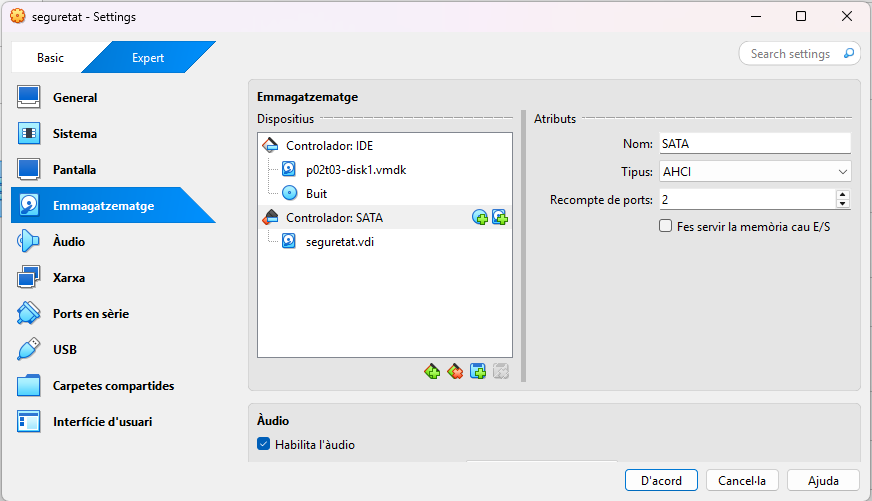
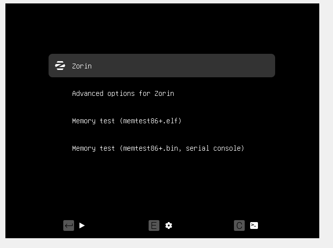
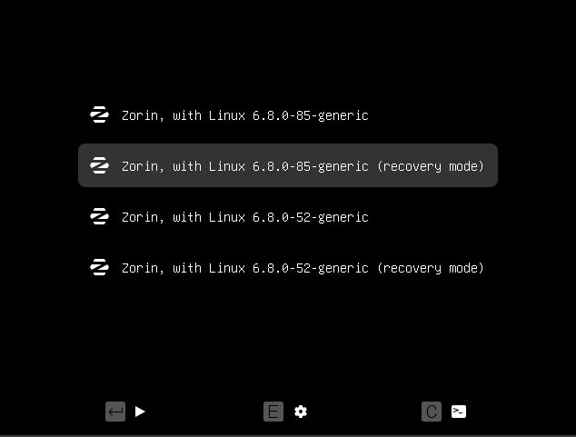
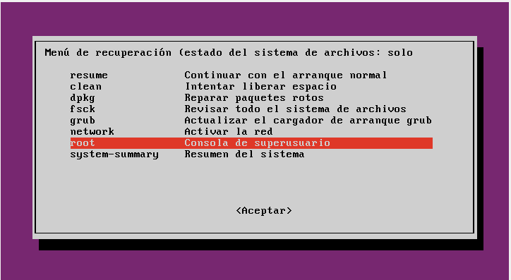
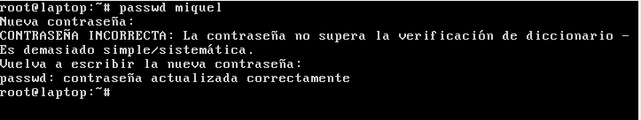
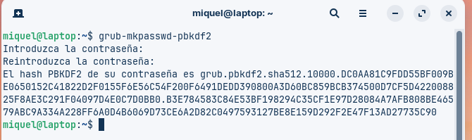
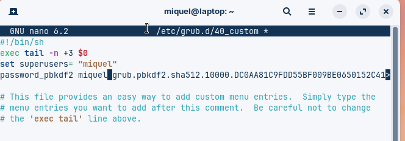
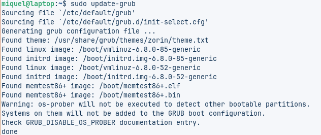

# Instruccions per restablir contrasenya i protegir GRUB

## Restablir contrasenya de l'usuari

1. Introduïu el disc a la màquina virtual.
   
2. Executeu la màquina virtual amb el disc del client inserit.
   
3. Escolliu l’opció: Linux 6.8.0-85-generic (recovery mode)
   
4. Obriu el menú de recuperació i executeu la consola com a **root**.
   
5. Utilitzeu la comanda següent per establir una nova contrasenya per l'usuari `miquel`:

```bash
passwd miquel
```

> Exemple de contrasenya: `12345678`

6. Un cop establerta la nova contrasenya, reinicieu la màquina i accediu a l’usuari **Miquel** amb la contrasenya restablerta.
   

---

## 🔐 Protegir GRUB amb contrasenya

### 1. Generar hash de la contrasenya
```bash
grub-mkpasswd-pbkdf2
```
Anoteu el hash generat.




### 2. Configurar GRUB

```bash
Editeu el fitxer /etc/grub.d/40_custom i afegiu-hi:

set superusers="usuari"
password_pbkdf2 usuari <hash_generat>
```




### 3. Actualitzar GRUB
```bash
sudo update-grub
```



---

⚠️ Notes

Això evita modificar opcions d’arrencada i accedir a la línia de comandes de GRUB sense autorització.

No protegeix contra arrencades des de dispositius externs si hi ha accés físic al sistema.

---

📚 Fonts

[Ubuntu Community: Grub2/Passwords](https://help.ubuntu.com/community/Grub2/Passwords)

[Red Hat Docs: Protecting GRUB](https://access.redhat.com/documentation/en-us/red_hat_enterprise_linux/7/html/security_guide/sec-protecting_grub)

[Way to IT: Protegiendo GRUB](https://waytoit.es/proteger-grub/)

---

[Tornar a l'inici](../README.md)
